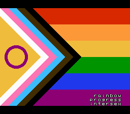

# Qalle's Pride Flag Show
Browse 49 pride flags on the [NES](https://en.wikipedia.org/wiki/Nintendo_Entertainment_System).

Table of contents:
* [List of files](#list-of-files)
* [How to assemble](#how-to-assemble)
* [How to use the NES program](#how-to-use-the-nes-program)
* [How to add new flags](#how-to-add-new-flags)
* [Technical info on the NES program](#technical-info-on-the-nes-program)
* [Sources of flags](#sources-of-flags)

## List of files
Images:
* `img/*.png`: pride flags to be read by `convert.py` (256&times;192 pixels)
* `img-hq/*.png`: high-quality backups of some flags
* `chr-spr.png`: sprite pattern table data; can be encoded using `nes_chr_encode.py` from [my NES utilities](https://github.com/qalle2/nes-util/)
* `snap*.png`: screenshots

Text:
* `convert.py`: a Python program that converts images of pride flags into NES graphics data; writes `imgdata.asm` and `chr-bg.bin`
* `pride.asm`: an NES program that shows the flags; assembles with [ASM6](https://www.romhacking.net/utilities/674/)
* `imgdata.asm`: data used by `pride.asm` (generated by `convert.py`)
* `assemble.sh`: a Linux script that assembles `pride.asm` (overwrites files; don't run it before reading it)

Other (gzip compressed):
* `pride.nes.gz`: the assembled NES program &ndash; current version
* `pride-compo.nes.gz`: the assembled NES program &ndash; [NESDev Compo 2022](https://itch.io/jam/nesdev-2022) version (old; has only 24 flags)
* `chr-bg.bin.gz`: background pattern table (CHR ROM) data in NES format (generated by `convert.py`)
* `chr-spr.bin.gz`: sprite pattern table (CHR ROM) data in NES format

## How to assemble
* run `convert.py` to generate `imgdata.asm` and `chr-bg.bin` (or just download them and extract the `.gz` files)
* encode `chr-spr.png` into `chr-spr.bin` using `nes_chr_encode.py` from [my NES utilities](https://github.com/qalle2/nes-util/) (or just extract `chr-spr.bin` from the `.gz` file)
* assemble: `asm6 pride.asm pride.nes` (or just extract `pride.nes` from the `.gz` file)

## How to use the NES program
* left arrow: previous flag
* right arrow: next flag
* A button: random flag
* start button: toggle flag descriptions on or off

## How to add new flags
You can add flags of your own to the NES program.
You need to have Python and ASM6 installed and may need to know some Python if things go wrong.
1. Delete some existing flags. (There are no free tiles at the moment.) If this causes `convert.py` to complain about missing files, delete references to them.
2. Open your flag image in an image editor (e.g. GIMP).
3. Resize the image to 256&times;192 pixels.
4. Convert the image into indexed color (so it has a palette).
5. Because of NES hardware limitations, the colors need to be optimized manually and the pixels may need to be edited as well. This is tricky, but follow these rules:
   * No more than 12 unique colors in addition to black.
   * All unique colors should be clearly distinct from each other. (Try copying colors from existing flags.)
   * Put a 16&times;16-pixel grid on the image (in GIMP, Image &rarr; Configure Grid&hellip; and View &rarr; Show Grid).
   * No grid square can have more than three distinct colors in addition to black.
   * In all grid squares combined, you can't use more than four unique sets of three distinct colors in addition to black.
6. Save the image in PNG format under the `img` directory. The filename before the extension (`.png`) is important:
   * It will be the flag description text (up to 8&times;3 characters) inside the NES program.
   * 24 characters or less.
   * Only `a`&ndash;`z`, `0`&ndash;`9`, hyphen (`-`) and underscore (`_`) are allowed.
   * Underscores will be converted into newlines.
   * No more than two underscores.
   * No more than eight consecutive non-underscore characters.
   * See the existing filenames for examples.
7. Run `python3 convert.py`. It should not print any errors. However, the palette creation algorithm isn't very smart, so if you're sure you followed step 4 correctly and the program still complains, you can define the palette manually: edit `MANUAL_SUBPALS` in `convert.py`. The output just before the error message and `NES_PALETTE` in `convert.py` will be helpful.
8. Extract `chr-spr.bin` from the `.gz` file. (Use e.g. `gunzip` on Linux or 7-Zip on Windows.)
9. Assemble: `asm6 pride.asm pride.nes` &ndash; again, it should not print any errors.
10. Run `pride.nes` on an NES emulator (e.g. FCEUX, Nestopia, Mednafen).

## Technical info on the NES program
* mapper: NROM
* PRG ROM: 16 KiB
* CHR ROM: 8 KiB
* name table mirroring: vertical
* pattern table 0: background (most flag images)
* pattern table 1 &ndash; first 224 tiles: background (some flag images)
* pattern table 1 &ndash; last 32 tiles: sprites (flag descriptions)
* each image has its own background palettes (black and 4&times;3 other colors)
* flag images are 256&times;192 pixels (32&times;24 tiles or 16&times;12 attribute blocks)
* flag images are shown at the bottom of a name/attribute table
* name/attribute table data of each flag image:
  * uncompressed size: 24&times;32 + 8&times;8 = 832 bytes
  * stored as 6 run-length encoded slices; the first 5 decompress into 140 bytes each, the last into 132 bytes
* an image is updated during 7 frames:
  * first 6 frames: extract one slice of name/attribute table data to an invisible name/attribute table
  * 7th frame: copy background palettes, do OAM DMA, flip visible name/attribute table, switch to correct background pattern table
  * for speed, all PPU memory updates (VRAM/palette) go through a buffer on the stack page (can be read quickly with PLA)

## Sources of flags
* [Androgyne](https://lgbtqia.fandom.com/wiki/Androgyne) - LGBTQIA+ Wiki
* [Aromantic Asexual](https://lgbtqia.fandom.com/wiki/Aromantic_asexual) - LGBTQIA+ Wiki
* [Asexual Furry Pride Fandom Flag](https://www.amazon.com/Asexual-Furry-Pride-Fandom-Flag/dp/B07F1K57P1) (black pawprint) - Amazon
* [Autism pride flag](https://commons.wikimedia.org/wiki/File:Autism_pride_flag.svg) (vertical stripes) - Wikimedia Commons
* [Autistic Pride Flag](https://commons.wikimedia.org/wiki/File:Autistic_Pride_Flag.png) (no stripes) - Wikimedia Commons
* [The Autistic Pride Flag](https://commons.wikimedia.org/wiki/File:The_Autistic_Pride_Flag.png) (horizontal stripes) - Wikimedia Commons
* [Demigender](https://lgbtqia.fandom.com/wiki/Demigender) - LGBTQIA+ Wiki
* [Demigirl Pride Flag](https://en.wikipedia.org/wiki/File:Demigirl_Pride-Flag.png) - Wikipedia
* [Demiguy Pride Flag](https://en.wikipedia.org/wiki/File:Demiguy_Pride-Flag.png) - Wikipedia
* [Furry Bisexual Pride Flag Lgbt](https://www.wackyprint.com/store/activism/lgbt/furry-bisexual-pride-flag-lgbt-colors-vibrant-bright) (black pawprint)
* [Furry LGBT Pride Flags (Series 1)](https://www.inanimorphs.com/product-page/furry-lgbt-pride-flags-series-1) - Inanimorphs
* [Furry Pride Flag](https://commons.wikimedia.org/wiki/File:Furry_Pride_Flag.png) - Wikimedia Commons
* [Nonhuman Unity Flag](https://en.wikipedia.org/wiki/File:Nonhuman_Unity_Flag.svg) (otherkin) - Wikimedia Commons
* [Omnisexual](https://lgbtqia.fandom.com/wiki/Omnisexual) - LGBTQIA+ Wiki
* [Pansexual Furry Pride Fandom Paw Flag](https://www.amazon.com/Pansexual-Furry-Pride-Fandom-Flag/dp/B07F1X4G6P) (black pawprint)
* [Pride flag](https://en.wikipedia.org/wiki/Pride_flag) - Wikipedia
* [Queer Pride Flag](https://queerintheworld.com/queer-pride-flag/) - Queer in the World
* [Rainbow flag (LGBT)](https://en.wikipedia.org/wiki/Rainbow_flag_%28LGBT%29) - Wikipedia
* [Sapphic](https://lgbtqia.fandom.com/wiki/Sapphic) - LGBTQIA+ Wiki
* [Transgender Furry Pride Fandom Paw Flag](https://www.amazon.com/Transgender-Furry-Pride-Fandom-Flag/dp/B07F1Y36D2)
* [Visually Safe Disability Pride Flag](https://commons.wikimedia.org/wiki/File:Visually_Safe_Disability_Pride_Flag.svg) - Wikimedia Commons

The license of this project does not apply to the flag images (I guess).
